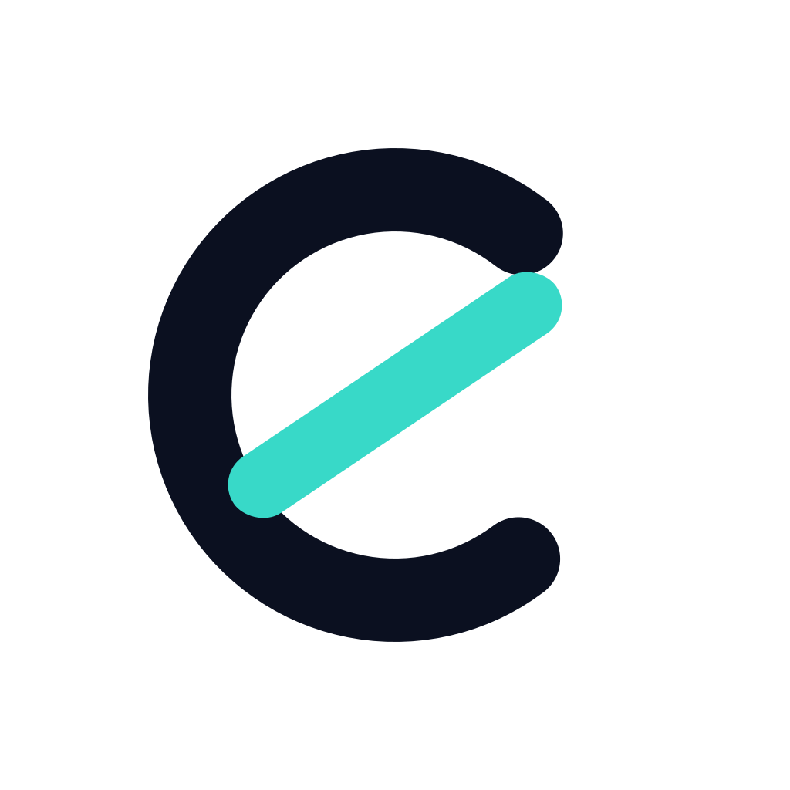
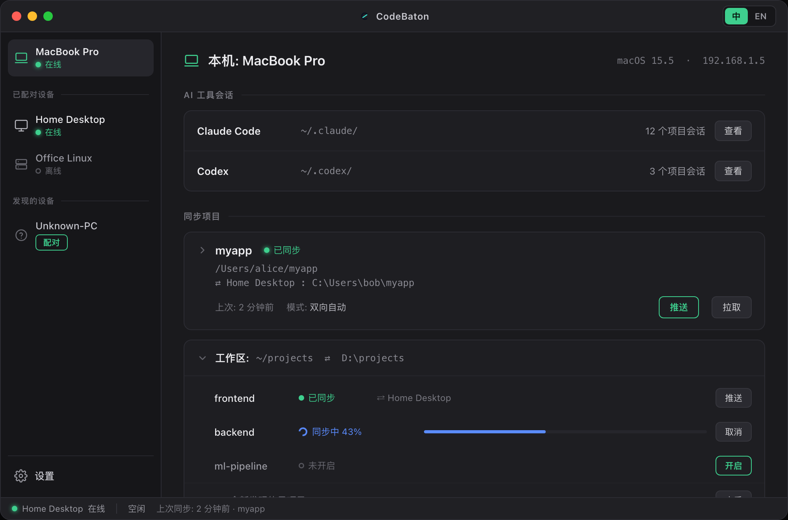

# CodeBaton

把正在跑的 AI 编程会话，在局域网内交给另一台机器接管运行。代码、未提交的改动、对话历史，整体搬过去——跑完再搬回来。全程不出本地网络。

 -555) 

> **不是远程桌面，不是云。** 是把执行负载真正搬到你自己的另一台机器，把主力机还给你。

## 为什么

AI agent 跑 build、测试、长任务时，会长时间占满你的机器、让笔记本飞速掉电、风扇狂转，而这段时间你干不了别的。CodeBaton 让你把这些重活卸载到局域网里的另一台机器（台式机、闲置的 Mac mini……），笔记本立刻解放——去开新任务，或遥控那台机器上的老任务。

## 能做什么

- **整体交接** — 代码 + 未提交的脏状态 + 对话历史，作为一个整体搬运，不只是同步配置文件。
- **跨平台路径重写** — 会话里的绝对路径在 macOS / Windows（含 WSL）/ Linux 之间自动适配，跨机即用。
- **双向同步** — 推过去，跑完再增量同步回来；产物实时回流本机，本地直接预览、安装、验收。
- **自动发现** — mDNS 零配置发现同网设备；也认 Tailscale / ZeroTier 组成的虚拟局域网。
- **跨工具迁移** — Claude Code → Codex（更多在路上），带着上下文换工具。
- **零云** — 数据一步不出本地网络。开源、可自行审计、可自行编译。

## 怎么用

1. **在主力机上开工** — 原生 CLI，流式输出、命令补全一个不少。交互最密的早期阶段，留在你手边。
2. **进入长跑，一键卸载** — 整体交接到另一台机器，路径自动重写，它在那边接管运行，你的笔记本腾出来。
3. **需要时，搬回来** — 双向增量同步。关掉那一头，绝不脑裂。

## 安装

从 [Releases](releases) 下载桌面客户端（macOS (Apple Silicon)），两台机器各装一个，同一局域网内即可互相发现。

## 支持

| | |
|---|---|
| **平台** | macOS (Apple Silicon) |
| **AI 工具** | Claude Code（更多在路上：Codex、Gemini CLI） |
| **网络** | 局域网 · Tailscale · ZeroTier · 手动 IP |

## 许可

[AGPL-3.0](LICENSE)。个人与团队可自由使用、自行编译。

若你的使用场景无法接受 AGPL（例如需要闭源集成、或对外提供服务且不愿开源改动），可通过 you@example.com 联系获取商业许可证。
